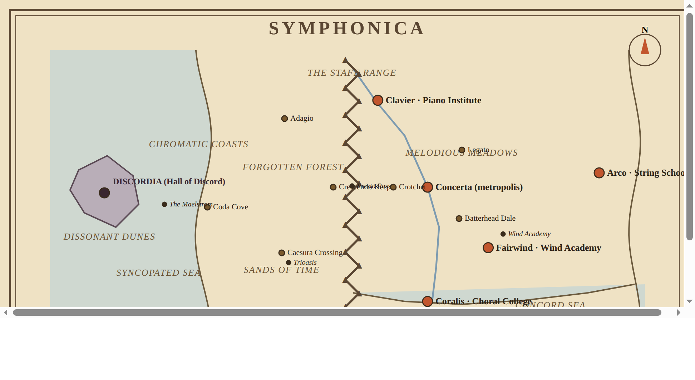

# Symphonica — World Map Reference

Companion to [`NARRATIVE.md`](./NARRATIVE.md). This file holds the canonical
geography, a **to-scale layout blueprint**, the AI image-generation prompt, and the
coordinate key used to build the map.

*The blueprint above is a schematic, not the finished art. Distances, landmasses,
the mountain band, sea widths, and the island are drawn to scale; settlement icons
are symbolic markers. Regenerate it with [`assets/map_blueprint.py`](./assets/map_blueprint.py).*

---

## How to actually get a "to-scale" map from an AI generator

Text prompts **cannot** enforce exact scale — generators approximate. The reliable path:

1. **Feed the blueprint as an image input** (img2img / ControlNet Canny or scribble /
   "image reference") at moderate strength (~0.4–0.6 denoise) together with the style
   prompt below. The model keeps the geometry and paints the parchment style over it.
2. If the tool is prose-only, generate the *style*, then **hand-place labels and fix
   positions** against the blueprint — map text comes out garbled either way.
3. Keep a **scale bar** in the final image; it's what makes "to scale" legible.

**A settlement can't be drawn to scale anyway.** At 1 in = 25 mi, Concerta's 5-mile
width is 0.2 in. Distances/landmasses are to scale; town & city *icons* are oversized
symbols + a scale bar (standard cartographic practice).

---

## Scale facts (internally consistent)

- **Scale:** 1 in = 25 mi. Always render a scale bar (a 100-mile bar = 4 in).
- **Extent:** ≈ 1,010 mi E–W × 475 mi N–S → ≈ 40 × 19 in → **`--ar 2:1`** (wide landscape).
- The continent fills the eastern ~two-thirds; sea + island the western third.
- **Known wording caveat:** the eastern heartland is the *larger* half because all five
  cities sit there (Arco is 300 mi east of Concerta). The Staff Range therefore divides
  the continent but sits in its **western-central** third, not dead-center. To make the
  range truly central instead, widen the western frontier to ~425 mi.

---

## Coordinate key (measured from Concerta = 0, 0; +X east, +Y north, miles)

| Place | From Concerta | Notes |
|---|---|---|
| **Concerta** (metropolis) | 0, 0 | central; largest icon |
| Staff Range (E edge) | 125 W | range 15 mi wide → W edge 140 W |
| Presto Pass | ~132 W, 0 | the one gap through the range |
| **Clavier** (Piano Institute) | 90 W, 150 N | rocky canyons, near N mountains |
| **Arco** (String School) | 300 E, ~25 N | far-eastern edge, isolated |
| **Fairwind** (Wind Academy) | 106 E, 106 S | far SE; Academy just **NE** of it |
| **Coralis** (Choral College) | 0, 200 S | S coast, tiered "riser" cliffs |
| Crotchet | 60 W, 0 | between Concerta & range |
| Legato | 60 E, 65 N | in Melodious Meadows |
| Batterhead Dale | 55 E, 55 S | on Concerta→Fairwind road |
| Crescendo Keep | 165 W, 0 | W mouth of Presto Pass |
| Adagio | 250 W, 120 N | NW frontier, forest edge |
| Caesura Crossing / Trioasis | 255 W, 115 S | in Sands of Time |
| Coda Cove | 385 W, 35 S | on Chromatic Coasts (W shore) |
| The Maelstrom | 460 W, 30 S | mid-sea whirlpool |
| **Discordia** (island city) | 565 W, 10 S | lone city; ~90 mi island |

West coast ≈ 390 mi W of Concerta; the Syncopated Sea is ~125 mi of open water between
coast and island. The Cadence River springs from the north end of the range and winds
SE through Concerta into the Concord Sea on the southern coast.

### The five cities (4 schools + 1 metropolis)
- **Concerta** — central metropolis; all musical backgrounds gather here. Hosts the regional
  inter-school contest (**the Concerta Invitational**, Zone 3) and, later, Paige's **Grand
  Artificer** forge/shop.
- **Fairwind** — far SE; the **Wind Academy** sits just NE on its outskirts.
- **Coralis** — far south on the Concord Sea; **Choral College** at the foot of riser cliffs.
- **Clavier** — N-NW canyon country; the **Piano Institute**.
- **Arco** — isolated far east; the **String School** (its remoteness echoes its
  friendly-rival, outsider status).

### Towns & villages
Batterhead Dale · Legato · Crotchet · Caesura Crossing · Crescendo Keep · Coda Cove · Adagio.
**Discordia is the only settlement on the island.**

---

## Image-generation prompt (scale-accurate)

> A highly detailed, hand-drawn **to-scale** fantasy world map in the style of J.R.R.
> Tolkien's Middle-earth cartography (Christopher Tolkien / Pauline Baynes) — aged sepia
> parchment with stains, torn edges and visible grain; fine ink linework; hand-lettered
> calligraphic labels; side-profile pictographic mountains; densely stippled forests;
> ornate illustrated border; a stylized sea with offset, syncopated rolling waves and one
> coiling sea-serpent. **Wide landscape map, 2:1 aspect, north up, orthographic top-down.
> Include a scale bar marked 1 inch = 25 miles.**
>
> Layout (positions to scale; settlement icons are symbolic markers): A continuous
> north–south mountain range with sharp, slightly uneven zigzags — the **Staff Range** —
> runs through the western-central part of the continent, drawn as roughly five long
> parallel ridgelines like the lines of a musical staff, some peaks shaped like
> note-heads; it is a thin band (about one-tenth the width of the eastern lands) with a
> single gap, **Presto Pass**, at mid-length. The eastern heartland is the larger half
> (warm ambers and golds), holding five cities: **Concerta**, the great central
> metropolis (largest icon); **Clavier** to the north-northwest in rocky canyons
> (~150 mi N, ~90 mi W of Concerta); **Arco** far to the east, isolated near the eastern
> edge (~300 mi E); **Fairwind** to the far south-east (~150 mi SE) with a small **Wind
> Academy** keep just north-east of it; and **Coralis** on the far southern coast at the
> foot of tiered choral-riser cliffs (~200 mi due S). Smaller towns: **Legato** (NE
> meadows), **Crotchet** (between Concerta and the range), **Batterhead Dale** (SE, on the
> Concerta–Fairwind road). A river, the **Cadence**, springs from the north end of the
> range and winds south-east through Concerta into the **Concord Sea** along the southern
> coast.
>
> West of the range is a narrower, cooler, untamed frontier: the **Forgotten Forest** in
> fog at the western foot of the mountains; the **Sands of Time** desert in the south-west
> (with the three-tree **Trioasis** and **Caesura Crossing** trading post); **Crescendo
> Keep** guarding the pass road; **Adagio** village in the north-west; and the rugged
> **Chromatic Coasts** along the western seaboard, with the port of **Coda Cove**.
>
> The far west: across the wide **Syncopated Sea** (irregular offset waves; a marked
> whirlpool, the **Maelstrom**) sits a single isolated island, dramatic and dark and
> Númenor-like, in cold grey-violet tones — home to only one settlement, the citadel-city
> of **Discordia (the Hall of Discord)**, ringed by the **Dissonant Dunes**. No other
> settlement on the island.
>
> Warm golden tones in the east shading to cold grey-violet around Discordia in the west,
> signaling corruption. Ornate compass rose in the NE; a decorative title cartouche
> reading **"SYMPHONICA"** centered along the top border; subtle staff-line/clef flourishes
> worked tastefully into the border. Antique, weighty, storied atmosphere.

**Negative / cleanup:** no modern elements; no satellite/photographic style; no bright
cartoon colors; no readable-but-wrong gibberish billboard text; place no settlement on the
island except Discordia; keep the mountains as one continuous north–south divider.
